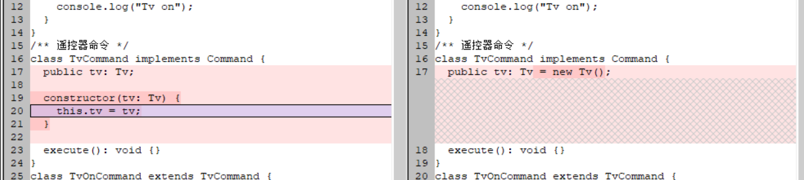
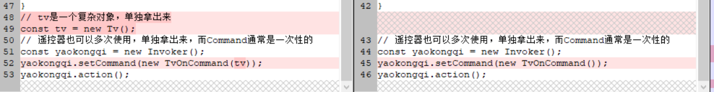

## 目的
1. **解耦**，将接收命令（Invoker）和执行命令（Receiver）的职责分离。
2. **扩展性**，可以轻易添加新的命令类型，无需改动现有代码，符合开闭原则。

## 角色
1. Invoker：调用者，调用命令
2. Command：抽象命令，声明执行操作的接口
3. ConcreteCommand：具体命令，实现Command，绑定Receiver
   > 这里有个很重要的地方，一个Receiver可以有多个Command，一个Command只能有一个Receiver。所以在定义命令时，必须明确接收者。电视遥控器的关机命令是影响不到手机的。  
4. Receiver：接收者，命令所作用的对象

> Invoker是遥控器，负责设置命令
> Command是命令，比如关机
> Receiver是电视，执行命令

## 依赖关系
1. Invoker：依赖于Command，使用接口完成调用（透明，不可见）
2. Command，依赖于Receiver（可见）
3. Receiver：无依赖

## 优化
1. 实际使用时，会发现这三个类全出现在Client里面了，这就导致高层模块对底层模块的强依赖。因此，在实际使用时，我们通常直接把Receiver封装到Command中，Command直接对应一个固定的Receiver，不需要用户指定。  
> optimized-ver.ts中修改的部分（右图）。  

