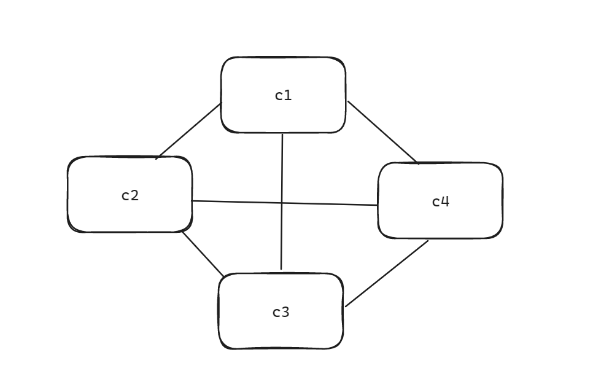
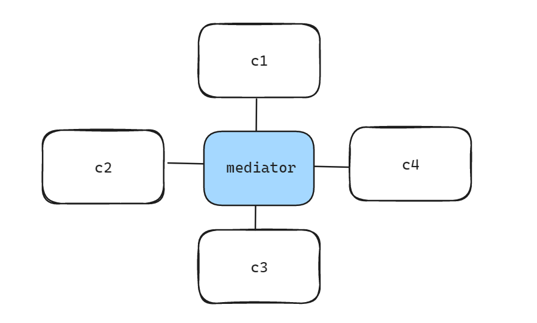

# 中介者模式/调停模式
## 目的
我举一个我的老师和我说的例子。假如你现在要租房子，如果直接去找各个房东，时间花费太多，于是你可以去找房屋中介，通过中介来与多个房东进行交流。  
我自己再举个例子，假如你要告诉亲朋好友参加聚会，一个个地发送消息未免太过麻烦，你应该创个群聊（中介），将消息发到群聊里面，群聊里面所有人都会收到消息。中介者模式正是用于处理这种一对多通信的。  
> 也可以一对一，但是一对一直接写就行了，除非是考虑到要添加功能，毕竟如果添加功能，原来实现了Imessage的类全都要添加一个方法（或者修改），就不是很方便了。  
### 低耦合/转移耦合
> 这句话相信不少人都听烦了。迪米特法则（最少知识原则，我比较喜欢叫成最少知道，更加直观）的核心就是低耦合。  
1. 低耦合，通常情况下，意为减少类之间的依赖。但是通过实现相同的接口，相互之间进行通信，并没有增加新的类依赖，但是内部多了很多其他对象（因为要调用对方的receive方法）。接收信息的对象越多，依赖就越多。而通过中介者，每个对象只需要依赖于中介者，就可以与任意多个其他对象进行通信。把网状的依赖，转换为了星形依赖。  

<div style="display: flex;">
    
    
</div>

> 补充: 下面这种方式在没有使用中介者模式的情况下，依然做到了一对多通信，所以完成通信这个目的并不是中介者模式的核心（而是基础，就好像你去考试，没人会夸你居然会写字）。  
> 事实上，中介者模式牺牲了中介者类的简单性，从而降低了通信对象的耦合度。中介者类本身是高耦合的，也是高内聚的。  

```ts
class Colleague{
  name:string;
  constructor(name:string){
    this.name = name;
  }
  send(receivers:Colleague[],message:string){
    // 由于需要调用对方的receive方法，所以必定会产生依赖
    receivers.forEach(receiver=>{
      receiver.receive(this,message)
    })
  }
  receive(sender:Colleague,message:string){
    console.log(`${this.name}收到来自${sender.name}的消息：${message}`)
  }
}

const c1 = new Colleague('张三')
const c2 = new Colleague('李四')
const c3 = new Colleague('王五')

c1.send([c2,c3],'hello')
```
### 高内聚/职责分离/方便管理
> 能够分离职责，主要是通信这个需求太过普遍，就好像迭代器这个需求也很普遍，也被分离出来了。  

把进行通信的职责都放到中介者对象中了，后续修改逻辑时，只需要修改中介者类，而不需要修改各个通信类。比如消息过滤、历史记录保存、用户权限控制等。假如不使用中介者，增加功能需要新写一个接口，然后为各个通信类实现方法，这样修改起来非常麻烦。
### 符合现实/面向对象
还是那个例子，通过群聊进行一对多通信，中介者被具现化为`群`，而`群`有其独特的属性（比如群聊名称，管理员列表等）。这是符合面向对象的思想的。  


## 实现
在需要通信的类之间，定义一个send方法和receive方法，在自身的send中，调用中介者的send方法，中介者再调用接收方的receive方法。
## 扩展
传统的中介者模式，是同一种基类之间进行通信。  
而不难发现，只要实现固定的方法，在中介类中调用就不是难事，重要的是如何处理中介者类的依赖问题。  
而接口就能处理这种问题。但是，接口对于复用还是存在问题，即使我希望各个类之间的表现是相同的（send和receive完全一致），我还是要在每个类中实现一遍完全一样的方法。多数情况下，如果是不同基类的对象接收信息，我们一般都是希望其产生不同的反应的（虽然在我的代码中没有体现），因此暂时可以忽略这个问题。  

## todo
* [ ] 使用mixins实现不同基类的相同的send和receive表现
